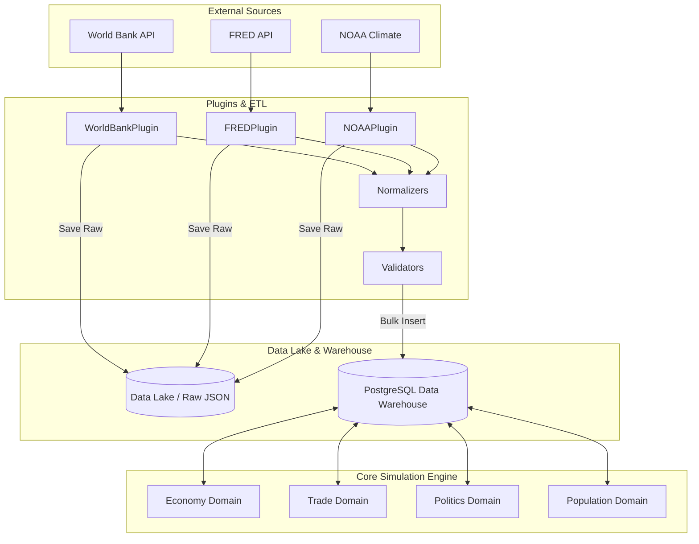
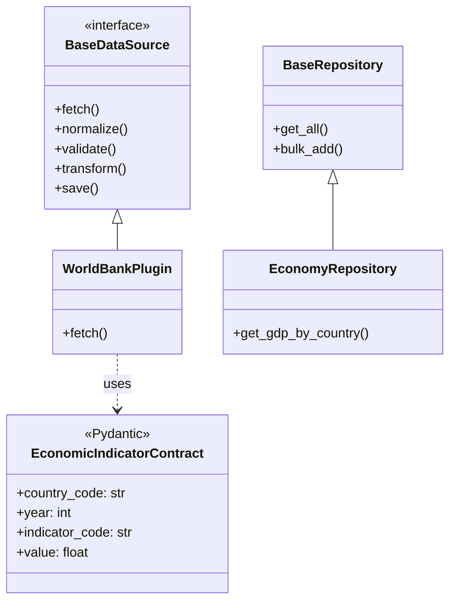

# Enterprise Data Platform Architecture Diagrams
## Wynthora World Simulation Engine

### 1. High-Level System Architecture

```mermaid
graph TD
    subgraph External Sources
        WB[World Bank API]
        FRED[FRED API]
        NOAA[NOAA Climate]
    end

    subgraph Data Ingestion Layer [Plugins & ETL]
        P_WB[WorldBankPlugin]
        P_FRED[FREDPlugin]
        P_NOAA[NOAAPlugin]
        
        Norm[Normalizers]
        Val[Validators]
        
        P_WB --> Norm
        P_FRED --> Norm
        P_NOAA --> Norm
        Norm --> Val
    end
    
    subgraph Storage [Data Lake & Warehouse]
        Lake[(Data Lake / Raw JSON)]
        DB[(PostgreSQL Data Warehouse)]
    end
    
    subgraph Application Domains [Core Simulation Engine]
        Econ[Economy Domain]
        Trade[Trade Domain]
        Pol[Politics Domain]
        Pop[Population Domain]
    end

    WB --> P_WB
    FRED --> P_FRED
    NOAA --> P_NOAA
    
    P_WB -->|Save Raw| Lake
    P_FRED -->|Save Raw| Lake
    P_NOAA -->|Save Raw| Lake
    
    Val -->|Bulk Insert| DB
    
    DB <--> Econ
    DB <--> Trade
    DB <--> Pol
    DB <--> Pop
```

### 2. Domain-Driven Design (DDD) Internal Structure

```mermaid
classDiagram
    class BaseDataSource {
        <<interface>>
        +fetch()
        +normalize()
        +validate()
        +transform()
        +save()
    }
    class WorldBankPlugin {
        +fetch()
    }
    class EconomicIndicatorContract {
        <<Pydantic>>
        +country_code: str
        +year: int
        +indicator_code: str
        +value: float
    }
    class BaseRepository {
        +get_all()
        +bulk_add()
    }
    class EconomyRepository {
        +get_gdp_by_country()
    }
    
    BaseDataSource <|-- WorldBankPlugin
    WorldBankPlugin ..> EconomicIndicatorContract : uses
    BaseRepository <|-- EconomyRepository
```
